# Image Segmentation of Brain Tumors using Convolutional Neural Networks
In this project we implement two different networks in order to create segmentation masks for identifying brain tumors.

* [U-Net Architecture](https://arxiv.org/abs/1505.04597) 
* [LinkNet Architecture](https://arxiv.org/abs/1707.03718)

The complete dataset can be accessed [here](http://dx.doi.org/10.6084/m9.figshare.1512427)

## Overview
- [Dataset Used](#Dataset-Used)
- [Model Architecture](#Model-Architecture)
- [Training Process](#Training-Process)
- [Results](#Results)

### Dataset Used
This brain tumor dataset contains 3064 T1-weighted contrast-inhanced images
from 233 patients with three kinds of brain tumor: meningioma (708 slices), 
glioma (1426 slices), and pituitary tumor (930 slices). Each image has the dimension (512 x 512 x 1).
The full dataset is available [here](http://dx.doi.org/10.6084/m9.figshare.1512427)

Original Image             |  Original Image With Mask
:-------------------------:|:-------------------------:
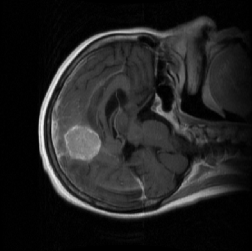  |  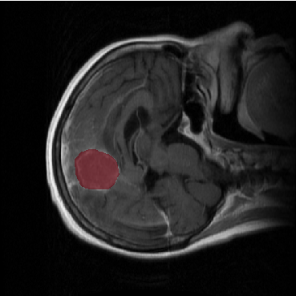

### Model Architecture

#### The model architecture for U-Net
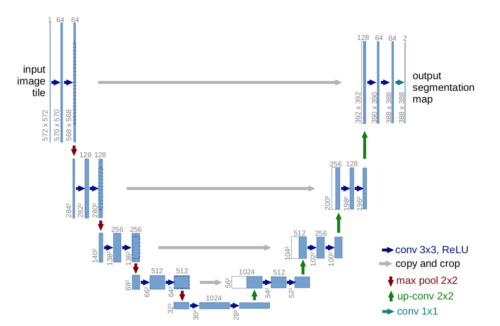

#### The model architecture for LinkNet
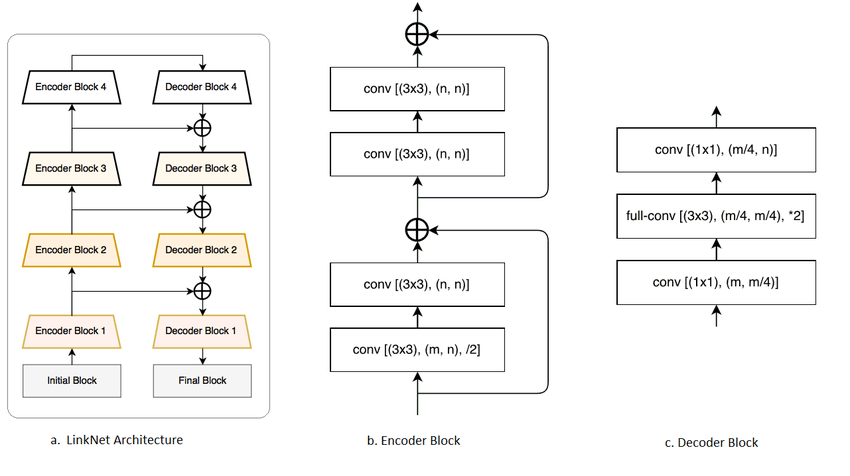

### Training Process

The networks were trained on a system with an AMD Ryzen 5 2600 processor overclocked to 4.0GHz, 16GB of RAM and an NVIDIA GeForce RTX 2070 GPU.

#### U-Net
We experimented with the number of initial filters and settled for 16. U-net was found to perform
well when using a batch size of 8. The initial learning rate was set to 10e−4 .

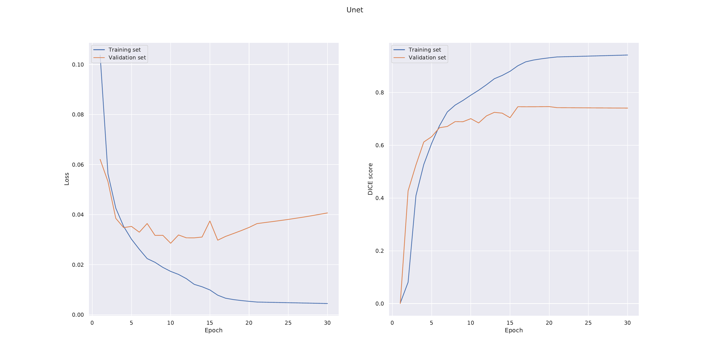

#### LinkNet
We experimented with the number of start filters and found that 64 seemed to give the best results.
We noticed that LinkNet seemed to be sensitive to parameter settings. LinkNet was trained using an initial learning rate of 5 · 10e−4 and a batch size of 10. Batch
normalisation was used after each convolutional layer. We also tried adding L2-regularisation but
that did not seem to significantly improve training.

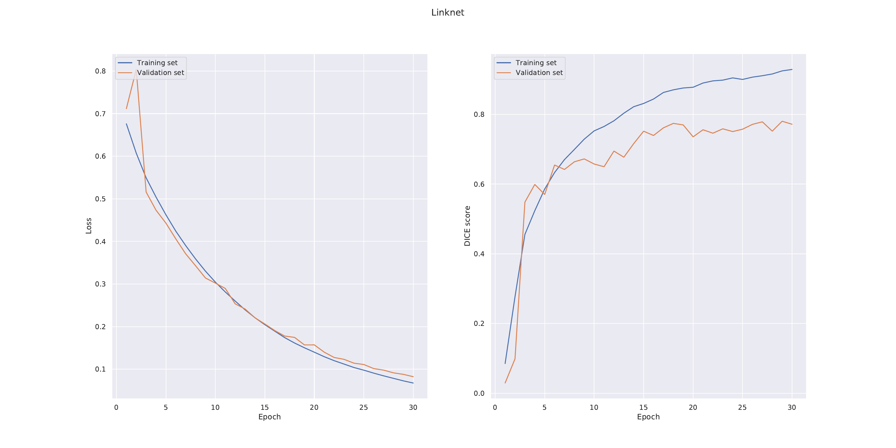

### Results

The final DICE scores achieved by the respective networks on the test set were

Method                     |         DICE Score
:-------------------------:|:-------------------------:
U-Net                      | 0.703
LinkNet                    | 0.715

Some samples from the predictions are shown below

U-Net                     |         Linknet
:-------------------------:|:-------------------------:
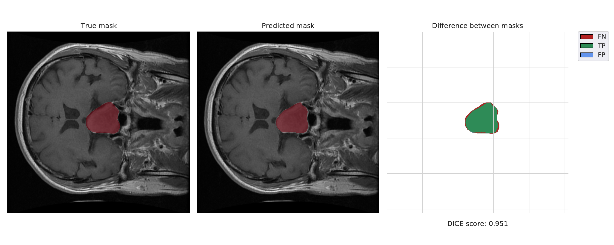 | 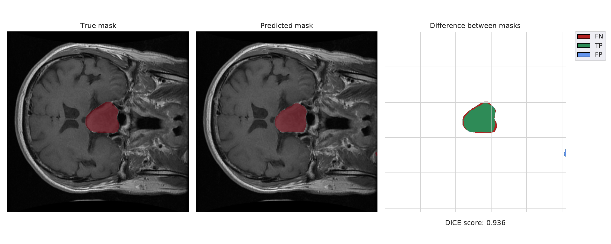
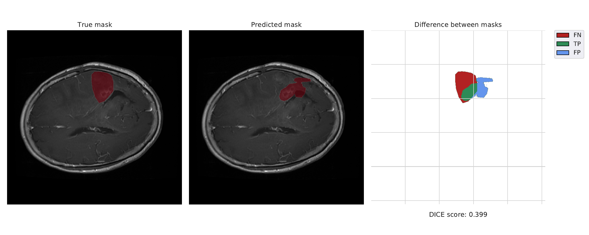 | 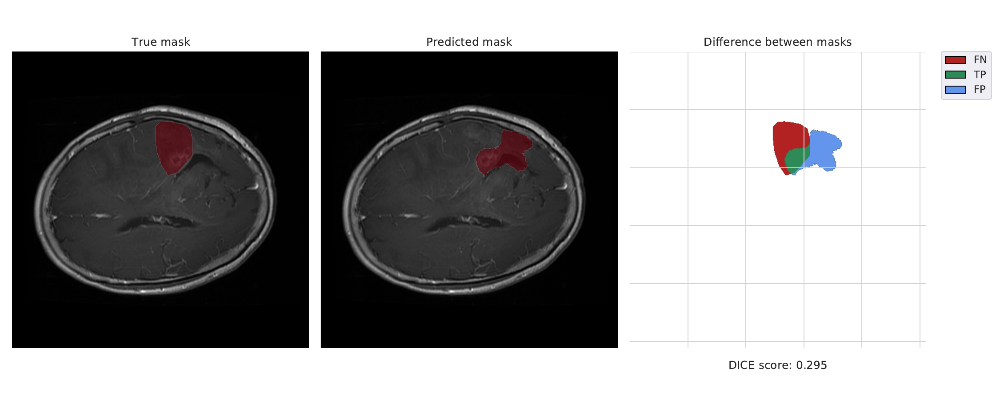
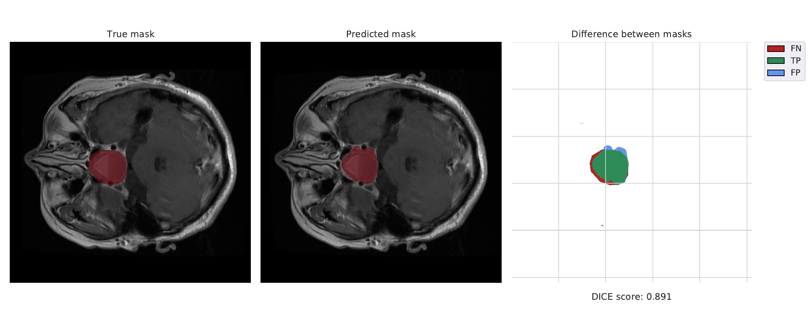 | 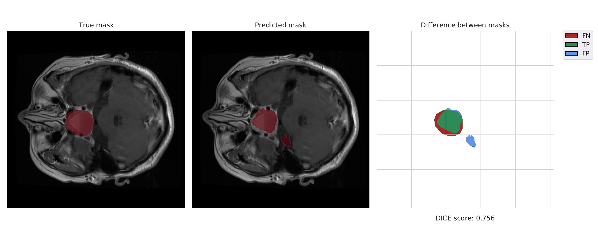
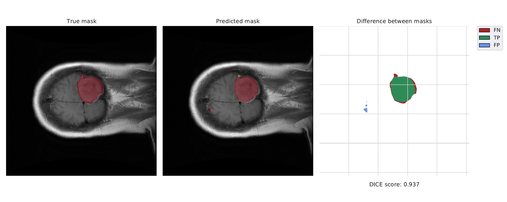 | 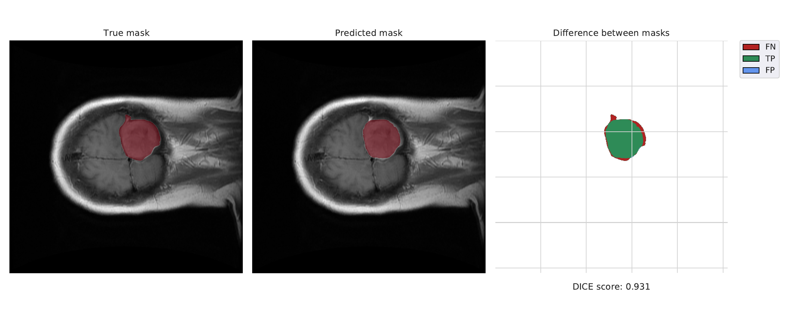
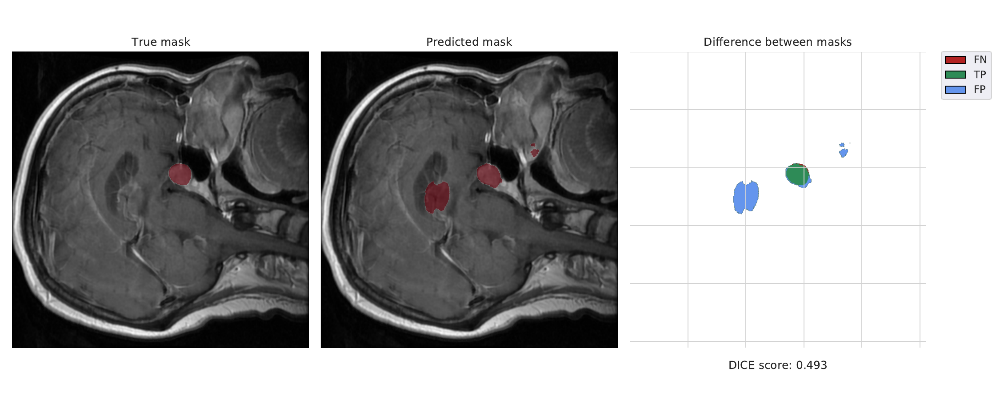 | 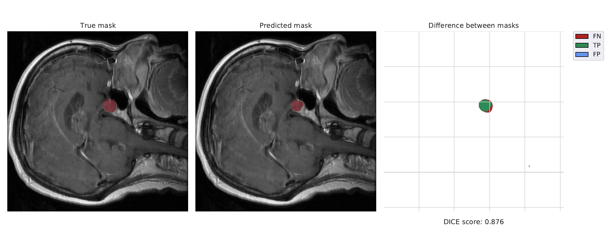

